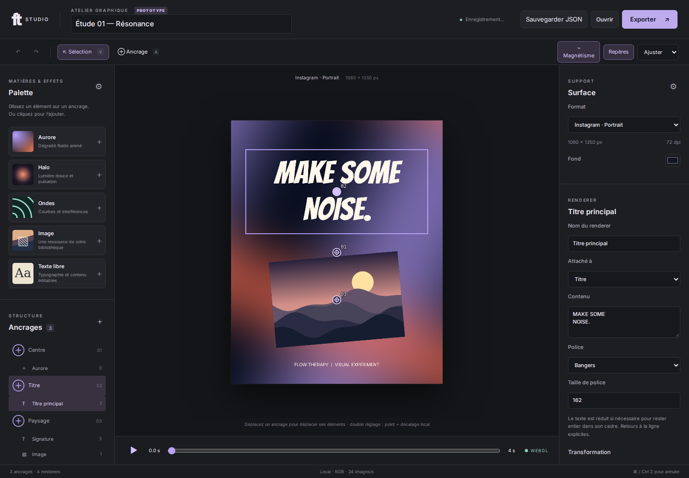

# Atelier graphique WebGL — prototype

Branche : `prototype/webgl-anchor-editor`. L'atelier est accessible par
**Atelier graphique · Prototype** dans la navigation ou directement à `/#graphique`.
Il reste indépendant des campagnes et de leur moteur de scène. Aucun changement
sur le site Pages n'est déclenché par cette branche.

```sh
git fetch origin
git switch prototype/webgl-anchor-editor
npm ci
npm run dev
# http://127.0.0.1:5173/#graphique
```



## Essai guidé

1. La composition de démonstration contient un shader Aurore, une illustration
   procédurale et deux textes. Utiliser Lecture ou le curseur pour voir l'animation.
2. Choisir **Ancrage** (`A`), puis déplacer le pointeur sur la surface : les axes
   horizontaux/verticaux et les milieux entre deux points apparaissent en vert.
   Cliquer pour créer le point. Magnétisme utilise un seuil de 9 pixels écran.
3. Glisser **Halo**, **Ondes**, **Image** ou **Texte libre** de la palette vers un
   ancrage. Un dépôt dans une zone libre crée un ancrage. Un clic sur une entrée
   l'ajoute à l'ancrage sélectionné, ou au centre si aucun point n'est sélectionné.
4. Déplacer un point entraîne ses renderers ; déplacer le cadre d'un renderer
   modifie ses décalages locaux. Le panneau de droite édite position, dimensions,
   rotation, opacité, couleur, teinte, saturation, luminosité, nom et ordre Z.
5. Glisser un renderer depuis l'arborescence vers un autre ancrage pour le
   rattacher et remettre ses décalages à zéro. Le champ **Attaché à** conserve
   quant à lui les décalages.
6. Supprimer un renderer dans l'inspecteur ou avec Suppr. La suppression d'un
   ancrage supprime ses éléments ; l'action est explicitement nommée et annulable.
   `Ctrl/Cmd Z`, `Ctrl/Cmd Shift Z` et les boutons permettent annuler/rétablir
   jusqu'à 30 étapes. Une manipulation de glissement compte pour une étape.
7. Choisir les images dans la bibliothèque du document ou importer une ressource
   de la bibliothèque partagée du studio. Les nouvelles images demandent une
   provenance ; PNG/JPEG sont aussi enregistrés dans le stockage partagé existant.
8. Ouvrir **Exporter** : PNG à l'instant courant, séquence PNG dans un ZIP avec
   manifeste de cadence, ou vidéo WebM/MP4 selon les capacités détectées.

## Contrats et extensions

| Document | Discriminant `kind` | Contenu |
| --- | --- | --- |
| Composition | `ft-graphic-project` | Surface instantanée, ancrages, renderers, images embarquées, fond et temps |
| Formats | `ft-surfaces` | Tableau `items` de surfaces en pixels, avec DPI indicatif |
| Palette | `ft-renderers` | Tableau `items` de presets avec `style` complet |

Tous les documents portent `schemaVersion: 1`. Les imports contrôlent version,
identifiants uniques, types, bornes, couleurs, références et images locales.
Une version future est refusée : une migration explicite sera nécessaire. Aucune
migration du document de campagne existant n'est introduite.

Les boutons de configuration dans les panneaux **Palette** et **Surface** ouvrent
chacun une boîte dédiée : import JSON, export JSON, édition de la définition et
application validée. Dupliquer une entrée avec un nouvel `id` ajoute un format ou
un preset. Les fichiers de départ sont `catalog/graphics/surfaces.json` et
`catalog/graphics/renderers.json`. Les compositions existantes gardent leurs
instantanés et ne sont pas modifiées par le remplacement d'un catalogue.

Une surface contient `id`, `name`, `width`, `height`, `dpi`. Les formats proposés
sont des préréglages de travail personnalisables, pas une garantie de conformité
aux zones de sécurité ou recadrages des plateformes : Instagram portrait
1080×1350, Facebook 1640×624, A3 3508×4961, A5 1748×2480, YouTube 1920×1080.

Les ancrages sont normalisés sur la surface (`x` et `y` entre 0 et 1). Chaque
renderer référence `anchorId` et possède des décalages locaux en pixels.
La rotation s'effectue autour de son centre ; plusieurs renderers peuvent
partager un point. Le milieu est celui du segment entre deux ancrages, y compris
un segment diagonal. Le déplacement reste libre hors des zones de magnétisme.

Le changement de surface conserve les coordonnées normalisées et redimensionne
les cadres et décalages proportionnellement aux axes. La police suit le plus
petit facteur. Ce n'est pas une composition adaptative ou une gestion de variantes.

Trois types sont implémentés : image, texte et shader. Un nouveau **preset** des
moteurs existants s'ajoute uniquement par JSON. Un nouveau **type de moteur** ou
algorithme GLSL exige une extension de `model.ts`, `engine.ts` et de l'inspecteur :
aucun JavaScript/GLSL arbitraire n'est exécuté depuis un import.

## Moteur et sauvegarde

`src/graphics/model.ts` porte le domaine pur et le magnétisme. `engine.ts` compose
une surface WebGL unique avec tri Z, textures d'images et textes, transformations
et colorimétrie. Les shaders Aurore, Halo et Ondes reçoivent temps, couleur,
vitesse et intensité. Les textes sont rasterisés avec les polices locales puis
composités sur le GPU ; ils sont réduits pour tenir dans leur cadre, sans
troncature, avec conservation des retours à la ligne explicites.

L'aperçu et les trois exports utilisent la même classe `GraphicEngine`.
L'aperçu plafonne son tampon à 1400 px sur le plus grand côté ; les exports
utilisent la résolution choisie et vérifient les limites matérielles WebGL.
Les ressources GPU des renderers supprimés sont libérées ; les contextes d'export
sont fermés après utilisation. Une perte de contexte produit un message explicite.

IndexedDB `ft-graphic-prototype` conserve un espace de travail local (composition
et deux catalogues), avec écritures sérialisées et statut visible. **Sauvegarder
JSON** inclut les images pour un transport autonome. Importer une composition
remplace celle en cours dans l'atelier et peut être annulé. Les documents restent
locaux ; ils ne sont ni ajoutés au dépôt, ni envoyés à un service.

## Limites réelles

- PNG raster RGB : pas de PDF, CMJN, fond perdu, profil ICC ni insertion de
  métadonnées DPI. Les dimensions A3/A5 correspondent à des cibles 300 dpi.
- Vidéo sans audio et en temps réel ; nombre effectif d'images variable selon
  navigateur/charge et onglet visible. Codec détecté avec `MediaRecorder`.
  La séquence PNG utilise exactement `frameIndex / fps` et garantit les instants
  demandés ; elle ne dépend pas de la fluidité de l'aperçu.
- Animation limitée aux paramètres temporels des shaders, sans pistes de
  keyframes sur les autres propriétés. La boucle de lecture n'implique pas que
  tous les shaders raccordent parfaitement leur première et dernière image.
- Durée 1–10 secondes, cadence entière 1–30 images/s. Séquences limitées à
  180 mégapixels cumulés pour borner la mémoire. Vidéo : 8,3 mégapixels par image.
- Maximum 100 ancrages, 100 renderers, 50 images, JSON 32 Mio, image importée
  12 Mio / 40 mégapixels. Surface : 6000 px par côté / 20 mégapixels, sous réserve
  des limites GPU. Les URL d'images distantes et SVG sont refusées.
- Les images sont ajustées en entier (`contain`), sans outil de recadrage.
  WebP est accepté dans le document du prototype ; la bibliothèque partagée
  existante peut le refuser et le signale sans perdre l'image du document.
- Polices Bangers, Inter, Kalam embarquées ; Georgia et monospace dépendent du
  système. Pas d'import de police depuis cet inspecteur ni de mise en forme riche.
- La sauvegarde automatique correspond à un espace local unique, sans résolution
  de conflits entre onglets. Exporter JSON avant de travailler dans plusieurs onglets.
- Catalogue édité par JSON, sans formulaire visuel de création de presets pour
  cette première itération. Interface adaptée aux petites largeurs, mais usage
  de composition recommandé avec une souris ; ajout par clic disponible sans drag.

## Build de prévisualisation

La CI de cette branche produit l’artefact `flowtherapy-graphic-prototype` après
les contrôles. Télécharger et décompresser le ZIP depuis le run GitHub Actions,
puis servir le dossier avec `python3 -m http.server 8080` et ouvrir
`http://localhost:8080/#graphique`. Ne pas ouvrir directement `index.html` en
`file://`, car les modules JavaScript nécessitent un serveur HTTP.

## Validation

`npm run check` vérifie typage, noyau, persistance et build ; `npm run test:e2e`
vérifie aussi l'atelier et les parcours existants. Les tests de l'atelier couvrent
magnétisme, rattachement, suppression/annulation, paramètres, persistance, imports,
catalogues, dimensions PNG, manifeste ZIP et décodage vidéo. WebGL logiciel est
activé explicitement dans Chromium headless CI. Aucun nouveau package de runtime
n'est ajouté : ZIP utilise `fflate` déjà présent.

La copie Inter du dépôt était tronquée (erreur Chromium `gvar: table overruns end
of file`). Elle a été remplacée par le fichier officiel
[Google Fonts](https://github.com/google/fonts/blob/main/ofl/inter/Inter%5Bopsz,wght%5D.ttf),
sous la licence OFL déjà incluse. La provenance du préréglage de marque est mise à jour.

Références techniques : [WebGL](https://developer.mozilla.org/en-US/docs/Web/API/WebGLRenderingContext),
[captureStream](https://developer.mozilla.org/en-US/docs/Web/API/HTMLCanvasElement/captureStream),
[MediaRecorder.isTypeSupported](https://developer.mozilla.org/en-US/docs/Web/API/MediaRecorder/isTypeSupported_static).
